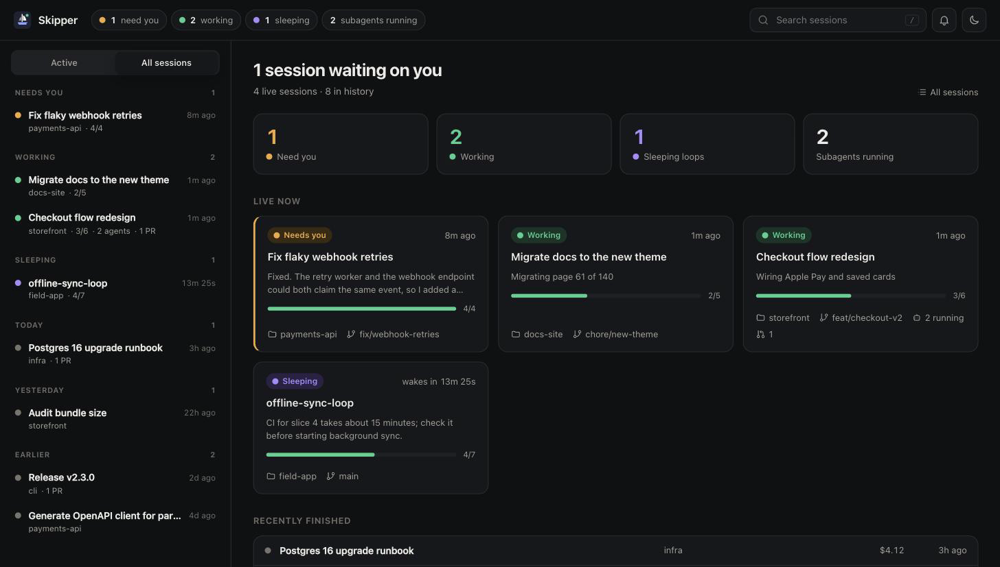

<div align="center">


# Skipper

**Mission control for Claude Code.** See every Claude Code session, subagent, `/loop` and todo list live in one local dashboard, and steer them without switching terminals.

[](https://github.com/bilol-makhmudov/skipper/actions/workflows/ci.yml)


[](LICENSE)



</div>

## Why Skipper?

Running several Claude Code agents at once is powerful and hard to follow. One terminal is waiting for an answer, another has three background subagents in worktrees, a third is a `/loop` sleeping until CI finishes. Skipper answers the question you keep asking: **which session needs me right now?**

- **Needs you, Working, Sleeping.** Every live session gets a clear state, taken from Claude Code's own session status. Sessions waiting on you rise to the top, and the browser tab title shows the count.
- **Todo lists and task lists.** Watch Claude's plan fill up in real time, including team task lists with owners and blockers.
- **Subagents.** Background agents with name, model, worktree branch, and when each one last did something.
- **`/loop` countdowns.** See when a self-paced loop wakes next and why it went to sleep.
- **Workflows, PRs and artifacts.** Multi-agent workflow runs, linked pull requests and published artifacts, one click away.
- **Cost and history.** Spend, turns and lines changed for every session, searchable across all your projects.
- **Desktop notifications** when a session finishes its turn or a subagent completes.

## Steer, not just watch


- **Message Claude.** Type the next instruction and Skipper hands it to the official CLI (`claude --bg --resume <session>`), so the session continues in the background. Attach any time with `claude attach`.
- **Edit tasks.** Add, rename, complete and delete tasks in a session's task list. Deleting a task that still blocks others is refused.
- **Private notes.** Keep notes per session, and send one to Claude when you are ready.
- **Read-only when you want it.** Start with `--read-only` and every write is switched off.

<table>
<tr>
<td width="50%"></td>
<td width="50%"></td>
</tr>
<tr>
<td align="center">Team tasks with owners and blockers (Paper theme)</td>
<td align="center">A sleeping <code>/loop</code> and its workflow run (Midnight theme)</td>
</tr>
</table>

## Quick start

```bash
npx github:bilol-makhmudov/skipper
```

Then open **http://localhost:4317**. Skipper finds your sessions in `~/.claude` automatically, and new ones appear the moment they start.

No Claude Code data yet, or want a tour first?

```bash
npx github:bilol-makhmudov/skipper --demo --open
```

### From source

```bash
git clone https://github.com/bilol-makhmudov/skipper.git
cd skipper
npm start          # or: npm run demo
```

Requires Node.js 20 or newer. There is nothing to install: Skipper has **zero runtime dependencies**.

## Themes

System, Light, Dark, **Midnight** (true black for OLED screens), **Paper** (warm and serif) and **High contrast**. Pick one from the moon/sun button in the top bar. Skipper also works as an installable app on your phone or desktop.

## Options

| Flag | Default | What it does |
| --- | --- | --- |
| `-p, --port <n>` | `4317` | Port to listen on (`$PORT` works too) |
| `--host <addr>` | `127.0.0.1` | Interface to bind. A non-loopback address turns on token access |
| `--claude-dir <dir>` | `~/.claude` | Claude Code data directory (`$CLAUDE_CONFIG_DIR` works too) |
| `--data-dir <dir>` | `~/.skipper` | Where Skipper keeps your notes |
| `--read-only` | off | Disable messages, notes and task edits |
| `--demo` | off | Serve fictional sample sessions |
| `-o, --open` | off | Open the dashboard in your browser |

### Check on agents from your phone

```bash
skipper --host 0.0.0.0
```

Skipper prints a link with a one-time access token for every network address. Open it on your phone once and a secure cookie keeps you signed in. Without the token, nothing is served.

### Keep it running on macOS

Save this as `~/Library/LaunchAgents/dev.skipper.plist` (adjust the paths), then run `launchctl bootstrap gui/$(id -u) ~/Library/LaunchAgents/dev.skipper.plist`:

```xml
<?xml version="1.0" encoding="UTF-8"?>
<!DOCTYPE plist PUBLIC "-//Apple//DTD PLIST 1.0//EN" "http://www.apple.com/DTDs/PropertyList-1.0.dtd">
<plist version="1.0">
<dict>
  <key>Label</key><string>dev.skipper</string>
  <key>ProgramArguments</key>
  <array><string>/opt/homebrew/bin/node</string><string>/path/to/skipper/bin/skipper.js</string></array>
  <key>RunAtLoad</key><true/>
  <key>KeepAlive</key><true/>
</dict>
</plist>
```

## How it works

Claude Code already records everything Skipper needs on your disk:

| Source | What Skipper reads |
| --- | --- |
| `~/.claude/projects/*/<session>.jsonl` | Titles, prompts, latest messages, todo lists, subagents, loops, workflows, PRs, cost |
| `~/.claude/projects/*/<session>/subagents`, `/workflows` | Subagent names, models, worktrees; workflow run results |
| `~/.claude/sessions/*.json` | Which sessions are live, and whether they are busy or idle |
| `~/.claude/tasks`, `~/.claude/teams` | Task lists and agent teams |

Transcripts are read incrementally from the last byte seen, so a history of hundreds of megabytes stays fast. File watchers push changes to the browser over Server-Sent Events, with no polling and no refresh.

## Privacy and security

Your sessions contain your code and prompts, so Skipper treats them that way:

- **Nothing leaves your machine.** No telemetry, no CDN, no external requests. The UI is plain HTML, CSS and JavaScript served from the package.
- **Loopback only by default**, with Host header checks against DNS rebinding.
- **Writes are locked down.** They need a custom header, a JSON body and a same-origin request, and every ID and path is validated. Messages go to the `claude` CLI as an argument list, never through a shell.
- **Strict Content Security Policy.** Everything is rendered with `textContent`, never raw HTML.

See [SECURITY.md](SECURITY.md) to report a vulnerability.

## FAQ

**Can Skipper type into a Claude Code terminal that is already open?**
No. Claude Code has no public API for that. Messaging an open session starts a background copy that continues from the same conversation, and Skipper warns you before you send. For finished or idle-and-closed sessions, the message continues the session itself.

**Does it work with agent teams, worktrees and background agents?**
Yes. Team task lists, owners, worktree branches and background subagents all show up.

**Windows and Linux?**
Skipper is plain Node.js and runs anywhere Claude Code does.

**Is this an official Anthropic product?**
No. Skipper is an independent open-source project for people who use Claude Code.

## Contributing

Issues and pull requests are welcome. Run `npm test` before you open a PR, and see [CONTRIBUTING.md](CONTRIBUTING.md). If Skipper saves you a trip through your terminals, a ⭐ helps other Claude Code users find it.

## License

[MIT](LICENSE)
